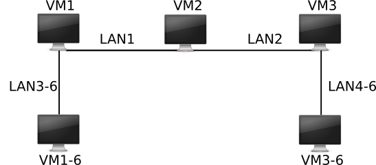

# Projet réseaux: Tunnel IPv6 sur IPv4
Dans ce projet nous considérons tout d'abord le réseaux suivant:

Malheureusement la machine **VM2-6** est sujette à des disfonctionnement. Nous devons donc ainsi dans ce projet faire en sorte que VM1-6 et VM3-6 puissent communiquer. Mais n'ayant pas de chemin IPv6 stricte entre les deux machines nous devrons transiter par notre ilot IPv4:

Le but de ce projet est donc de créer, suite à la disparition de VM2-6, un tunnel qui nous permettra de transporter des paquets IPv6 sur un ilot IPv4, rétablissant ainsi les communications entre les machines sur les réseaux LANX-6.
# Arboresence du projet:
## Template:
    [nom_de_dossier/] {Rôle de ce dossier dans l’archive}
    [nom_de_ficher]   {Rôle de ce fichier dans l’archive}
## Dans notre Projet, vous trouverez les éléments suivants:
    [ iftun/ ] { Contient tout notre code C permettant de créer une interface tun0 }
        [ tunalloc.c et tunalloc.h ] { Code source et librarie de tunalloc }
        [ iftun.c et iftun.h ]       { Code source et librarie de iftun }
        [ Makefile  ]                { Permet de compiler iftun et d’envoyer directement
                              dans /VMs/partage un executable de iftun (à l’aide de la commande “make”)}

    [ VMs/ ]
        [ VM1/ à VM3-6/ ]                            { Répertoire des machines virtuelles du projet }
            [ Les fichiers salt ] {Permet une configuration automatique des machines à leur lacement }
            [ Vagrantfile ]                          { Permet le lancement d’une machine }
            [ POUR VM1 UNIQUEMENT launch_server.sh ] { Lance l’extremité serveur du tunnel IPv6 sur IPv4 }
            [ POUR VM3 UNIQUEMENT launch_client.sh ] { Lance l’extremité client du tunnel IPv6 sur IPv4 }
    [destroy_all_VMs.sh] { Detruit (une par une) toutes les machines virtuelles des repertoires VM*/ }
    [launch_all_VMs.sh]  { Lance (SIMULTANEMENT) toutes les machines virtuelles des repertoires VM*/ }
    
    [ partage/ ] { Dossier partagé par toutes les machines virtuelles }
        [ test_iftun ]             { Exécutable de notre code C (création de tunnel) }
        [ client.js et server.js ] { Permettent de lancer respectivement le client et le serveur du tunnel. }
        [ config.json ]            { Fichier de configuration utilisé par le client et le serveur }
        [ launch_salt.sh ]         { Lance automatiquement dans le bon repertoire salt pour configurer la machine }
        [ routing.sh ]             { Script qui affiche les routes IPv4 et IPv6 de la machine }

## Box utilisée dans le projet:
La box utilisée pour faire tourner les machines virtuelles est donnée sur le site de M.GODARD: (Section 1.1 : Changement de box)

https://pageperso.lis-lab.fr/emmanuel.godard/enseignement/m1%20reseaux/01_routageipv4/#toc3

Notre projet se base donc sur la box **debianTP.box**.

## Lancement des machines (Setup):
Vous pouvez, pour lancer les machines utiliser le script [/VMs/launch_all_VMs.sh].

**Attention!!! ce script lance en parrallèle toutes les machines, assurez vous d'avoir les ressources nécessaires à leurs lancement (~ 8Gb de RAM de préférence).**

Une fois lancées, et pour chaque machine, vous devez vous octroyer les droits root, executez: 

`$ sudo -s` (le mot de passe est "m1reseaux" si vous utilisez bien la box **debianTP.box**.)

Par la suite nous utiliserons salt afin de configurer automatiquement les machines. Deplacez vous donc dans le répertoire **/mnt/partage/** de la VM:

`# cd /mnt/partage/`

Et executez le script qui ce chargera de lancer salt pour vous:

`# ./launch_salt.sh`

Votre machine, une fois la commande ci-dessus terminée, est configurée vous pouvez dès à présent utiliser le reseaux de VMs.

## Contact:
Ce projet à été réalisé par:

**ANDRE jérémy** - jeremy.ANDRE.1@etu.univ-amu.fr

**ABDEL WAHAB Ismail** - ismail.ABDEL-WAHAB@etu.univ-amu.fr
